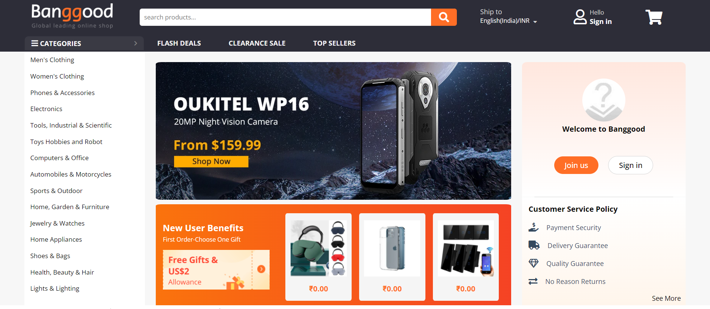
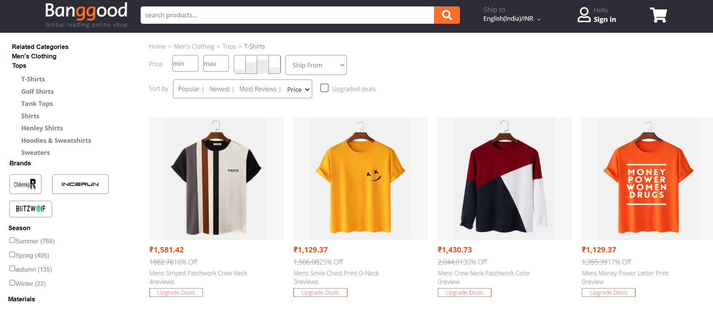
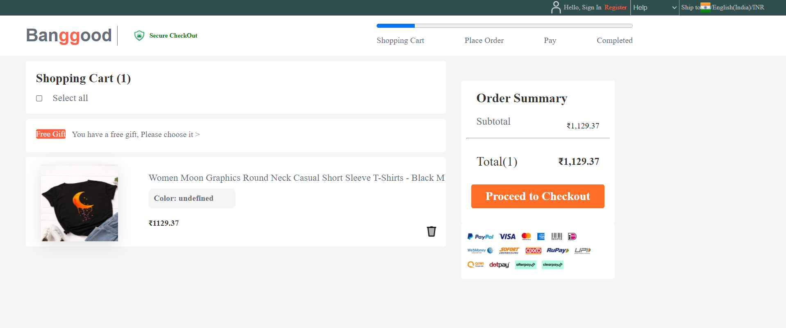
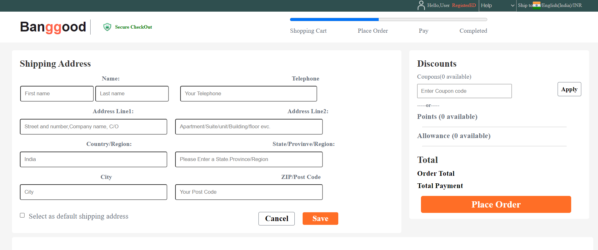
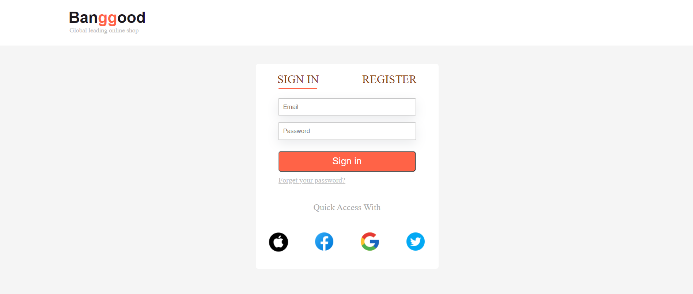

# Banggood
An E-commerce platform to buy a wide range of products.

Features:
Optimized And Functional Interface.
Client Sign-in/Sign-up
Responsive Design.

Tech Stack: HTML | CSS | Javascript | Bootstrap

Areas Of Responsibility:
Aggregated and combined data from 7+ public data sources
to create this website.
Deployed the website on netlify for easy availability.
Handled and problem-solved multiple tasks for better client
experience.

An Individual project executed in 5 days.

 Blog Link:-
 https://medium.com/@mohsiniqbal826635/building-the-clone-of-banggood-website-5698707e4dcf
 
 Google Drive Link:-
https://drive.google.com/file/d/1gZwqaJCXDbgERsO8SI_dkV4SC2PdeCNZ/view?usp=sharing

LIVE DEMO:https://brilliant-maamoul-240258.netlify.app/

## Some of the screenshots are below:-

